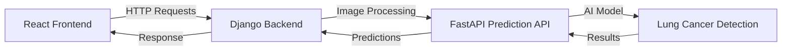

# 🔬 Lung Cancer Detection API - FastAPI Microservice

[](https://fastapi.tiangolo.com)
[](https://python.org)
[](https://docker.com)
[](LICENSE)

A **production-ready FastAPI microservice** for lung cancer detection from medical images using AI/ML models. This is the **prediction API component** of a larger lung cancer detection system.

## 🏗️ System Architecture

This repository contains the **FastAPI prediction microservice** as part of a distributed system:

- **Frontend**: [LungCancerDetection-frontend](https://github.com/eng-EslamEzzat/LungCancerDetection-frontend) (React/JS)
- **Backend**: [LungCancerDetection-backend](https://github.com/eng-EslamEzzat/LungCancerDetection-backend) (Django/Python)
- **Prediction API**: **This Repository** (FastAPI/Python) - AI/ML Model Inference



## 🏗️ Architecture

This microservice follows a **clean architecture pattern** with clear separation of concerns:

```
microservices/fastapi/
├── app/                          # Application code
│   ├── __init__.py
│   ├── main.py                   # FastAPI app initialization
│   ├── api/                      # API layer
│   │   ├── __init__.py
│   │   └── v1/                   # API version 1
│   │       ├── __init__.py
│   │       └── endpoints.py      # API endpoints
│   ├── core/                     # Core configuration
│   │   ├── __init__.py
│   │   ├── config.py             # Settings and configuration
│   │   └── logging.py            # Logging setup
│   ├── models/                   # Data models (future use)
│   │   └── __init__.py
│   ├── schemas/                  # Pydantic schemas
│   │   ├── __init__.py
│   │   └── prediction.py         # Request/response schemas
│   ├── services/                 # Business logic
│   │   ├── __init__.py
│   │   └── image_processor.py    # Image processing service
│   └── utils/                    # Utility functions
│       └── __init__.py
├── tests/                        # Test files
│   └── test_api.py              # API tests
├── scripts/                      # Utility scripts
├── requirements.txt              # Python dependencies
├── Dockerfile                    # Container configuration
├── docker-compose.yml            # Multi-container setup
├── .env.example                  # Environment variables template
└── README.md                     # This file
```

## 🚀 Features

### Core Features
- **Image Upload & Processing**: Accept medical images via HTTP API
- **Lung Cancer Detection**: AI-powered analysis with confidence scores
- **Multiple Image Formats**: Support for JPEG, PNG, TIFF, BMP
- **Health Monitoring**: Comprehensive health checks and status reporting
- **Auto Documentation**: OpenAPI/Swagger documentation

### Technical Features
- **Clean Architecture**: Modular, testable, and maintainable code structure
- **Configuration Management**: Environment-based configuration with validation
- **Structured Logging**: Comprehensive logging with configurable levels
- **Error Handling**: Proper HTTP status codes and error responses
- **Input Validation**: Pydantic schemas for request/response validation
- **Security**: Non-root container user, CORS protection
- **Performance**: Optimized Docker image with layer caching

## 🛠️ Deployment Options

### 📋 Prerequisites
- **Local**: Python 3.9+, Anaconda environment
- **Docker**: Docker Desktop (Windows/Mac) or Docker Engine (Linux)
- At least 2GB RAM available

### 🚀 Quick Start (3 Methods)

#### Method 1: Automated Deployment Script
```powershell
# Local deployment
python deploy.py local

# Docker deployment
python deploy.py docker

# Docker Compose deployment
python deploy.py compose

# With automatic testing
python deploy.py docker --test
```

#### Method 2: Local Development
```powershell
# 1. Activate Anaconda environment
& "E:/Coding/Anaconda3/shell/condabin/conda-hook.ps1"; conda activate

# 2. Install dependencies
pip install -r requirements-local.txt

# 3. Configure environment
copy .env.example .env
# Edit .env file as needed

# 4. Run the server
python -m uvicorn app.main:app --host 0.0.0.0 --port 8000 --reload
```

#### Method 3: Docker Deployment
```powershell
# Using Docker Compose (Recommended)
docker-compose up --build

# Or using Docker directly
docker build -t fastapi-lung-cancer .
docker run -d -p 8000:8000 --env-file .env --name fastapi-container fastapi-lung-cancer
```

### 🌐 Access the Service (All Methods)
- **API Base URL**: http://localhost:8000
- **Swagger Documentation**: http://localhost:8000/docs
- **ReDoc Documentation**: http://localhost:8000/redoc
- **Health Check**: http://localhost:8000/health
- **Model Info**: http://localhost:8000/model/info

## 📡 API Endpoints

### Health & Info Endpoints

#### `GET /`
Root endpoint with service information.

#### `GET /health`
Comprehensive health check including model status.
```json
{
  "status": "healthy",
  "service": "Lung Cancer Detection API",
  "version": "1.0.0",
  "timestamp": "2024-01-15T10:30:00Z",
  "uptime_seconds": 3600.5,
  "model_loaded": true
}
```

#### `GET /model/info`
Information about the loaded model and configuration.
```json
{
  "model_loaded": true,
  "supported_formats": ["image/jpeg", "image/png", "image/tiff", "image/bmp"],
  "max_file_size_mb": 50,
  "model_input_size": [224, 224],
  "confidence_threshold": 0.5
}
```

### Prediction Endpoint

#### `POST /predict`
Upload an image for lung cancer prediction.

**Request**: Multipart form data with image file
**Response**:
```json
{
  "status": "success",
  "filename": "chest_xray.jpg",
  "image_info": {
    "width": 512,
    "height": 512,
    "channels": 3,
    "format": "JPEG"
  },
  "image_stats": {
    "mean_intensity": 145.2,
    "std_intensity": 67.8,
    "shape": [512, 512, 3],
    "size_bytes": 123456
  },
  "prediction_result": {
    "prediction": "Normal",
    "confidence": 0.85,
    "probabilities": {
      "Normal": 0.85,
      "Suspicious": 0.10,
      "Malignant": 0.05
    },
    "processing_time_ms": 250.5
  },
  "message": "Image processed successfully",
  "timestamp": "2024-01-15T10:30:00Z"
}
```

## 🧪 Testing

### Run Tests
```powershell
# Manual test execution (works with any deployment method)
python tests/test_api.py

# Using the deployment script with automatic testing
python deploy.py docker --test
python deploy.py compose --test

# Using pytest (if installed)
pytest tests/test_api.py -v
```

### Test Coverage
The test suite covers:
- Health check endpoint
- Model information endpoint
- Successful image prediction
- Invalid file type handling
- Empty file handling
- Missing file handling

### Manual Testing with cURL
```powershell
# Health check
Invoke-RestMethod -Uri "http://localhost:8001/health" -Method GET

# Upload image for prediction
$form = @{ file = Get-Item "path\to\your\image.jpg" }
Invoke-RestMethod -Uri "http://localhost:8001/predict" -Method POST -Form $form
```

## ⚙️ Configuration

### Environment Variables
Configure the service using environment variables in `.env`:

```env
# Application
APP_NAME="Lung Cancer Detection API"
DEBUG=false
LOG_LEVEL=INFO

# Server
HOST=0.0.0.0
PORT=8000

# File Processing
MAX_FILE_SIZE=52428800  # 50MB
MODEL_PATH="/app/models/lung_cancer_model.h5"
MODEL_INPUT_SIZE="224,224"
CONFIDENCE_THRESHOLD=0.5

# Security
SECRET_KEY="your-secret-key-here"
ALLOWED_ORIGINS="*"
```

### Adding Your Model

1. **Place your trained model** in the microservice directory:
   ```powershell
   mkdir models
   copy your_model.h5 models\lung_cancer_model.h5
   ```

2. **Update docker-compose.yml** to mount the model:
   ```yaml
   volumes:
     - ./models:/app/models:ro
   ```

3. **Modify the image processor** (`app/services/image_processor.py`):
   ```python
   def _load_model(self):
       import tensorflow as tf
       self.model = tf.keras.models.load_model(settings.MODEL_PATH)
       self.model_loaded = True
   ```

## 🐳 Docker Configuration

### Development Mode
```powershell
# Start with code mounting for development
docker-compose -f docker-compose.yml up -d

# Enable development mode in docker-compose.yml:
# volumes:
#   - ./app:/app/app:delegated
```

### Production Mode
```powershell
# Start with nginx reverse proxy
docker-compose --profile production up -d

# Start with monitoring
docker-compose --profile monitoring up -d
```

### Resource Limits
The service is configured with reasonable resource limits:
- **Memory**: 2GB limit, 512MB reserved
- **CPU**: 1.0 limit, 0.5 reserved

## 📊 Monitoring & Observability

### Health Monitoring
- Automatic health checks every 30 seconds
- Uptime tracking
- Model status monitoring
- Detailed error logging

### Metrics (Optional)
Enable Prometheus monitoring:
```powershell
docker-compose --profile monitoring up -d
```
Access metrics at http://localhost:9090

### Logging
- Structured JSON logging
- Configurable log levels
- Request/response logging with timing
- Error tracking with stack traces

## 🔒 Security

### Container Security
- Non-root user execution
- Minimal base image (Python slim)
- Read-only model mounting
- Resource limits

### API Security
- CORS configuration
- Input validation with Pydantic
- File type validation
- File size limits
- Proper error handling without information leakage

### Production Recommendations
- Use HTTPS (configure nginx proxy)
- Set strong `SECRET_KEY`
- Limit `ALLOWED_ORIGINS` to specific domains
- Enable authentication middleware
- Regular security updates

## 🚀 Deployment

### Local Development
```powershell
cd microservices/fastapi
docker-compose up --build
```

### Production Deployment
1. **Configure environment variables** for production
2. **Add your trained model** to the models directory
3. **Enable nginx proxy**: `docker-compose --profile production up -d`
4. **Set up SSL certificates** for HTTPS
5. **Configure monitoring**: `docker-compose --profile monitoring up -d`

### Scaling
Scale the service horizontally:
```powershell
docker-compose up -d --scale fastapi-lung-cancer=3
```

## 🔧 Development

### Local Development Setup
```powershell
# Install dependencies
pip install -r requirements.txt

# Run development server
python -m uvicorn app.main:app --reload --host 0.0.0.0 --port 8000
```

### Code Structure Guidelines
- **Separation of Concerns**: Each module has a single responsibility
- **Dependency Injection**: Services are injected where needed
- **Error Handling**: Proper exception handling with meaningful messages
- **Type Hints**: Full type annotation for better IDE support
- **Documentation**: Comprehensive docstrings and comments

### Adding New Features
1. Add business logic to `app/services/`
2. Define schemas in `app/schemas/`
3. Create API endpoints in `app/api/v1/`
4. Write tests in `tests/`
5. Update documentation

## 🔍 Troubleshooting

### Common Issues

#### Port Already in Use
```powershell
# Change port in docker-compose.yml
ports:
  - "8002:8000"  # Use different port
```

#### Model Loading Errors
```powershell
# Check model file exists and permissions
docker-compose exec fastapi-lung-cancer ls -la /app/models/

# Check logs for specific errors
docker-compose logs fastapi-lung-cancer
```

#### Memory Issues
```powershell
# Increase Docker memory limit or reduce model size
# Check resource usage
docker stats
```

#### Container Won't Start
```powershell
# Check detailed logs
docker-compose logs --tail=50 fastapi-lung-cancer

# Check container health
docker-compose ps
```

### Debugging
- Enable debug mode: Set `DEBUG=true` in `.env`
- Increase log level: Set `LOG_LEVEL=DEBUG`
- Access container shell: `docker-compose exec fastapi-lung-cancer bash`

## 🔗 Related Repositories

This microservice is part of a larger lung cancer detection system:

| Repository | Description | Technology | Status |
|------------|-------------|------------|--------|
| [LungCancerDetection-frontend](https://github.com/eng-EslamEzzat/LungCancerDetection-frontend) | User interface for medical professionals | React, JavaScript | ✨ Active |
| [LungCancerDetection-backend](https://github.com/eng-EslamEzzat/LungCancerDetection-backend) | Main application backend with user management | Django, Python | ✨ Active |
| [lung-cancer-detection-api](https://github.com/eng-EslamEzzat/lung-cancer-detection-api) | **This Repository** - AI prediction microservice | FastAPI, Python | ✨ Active |

## 🤝 Contributing

1. Fork the repository
2. Create a feature branch
3. Follow the existing code structure and patterns
4. Add tests for new functionality
5. Update documentation
6. Submit a pull request

## 📄 License

MIT License - feel free to use this project for educational and commercial purposes.

## 👤 Author

**Eslam Ezzat**
- GitHub: [@eng-EslamEzzat](https://github.com/eng-EslamEzzat)
- LinkedIn: [@esllamofficial](https://www.linkedin.com/in/esllamofficial/)

---

**Need Help?** 
- Check the logs: `docker-compose logs fastapi-lung-cancer`
- Review the troubleshooting section above
- Open an issue in this repository
- Check the API documentation at http://localhost:8000/docs

**Full System**: For the complete lung cancer detection system, check out all three repositories above! 🎆
